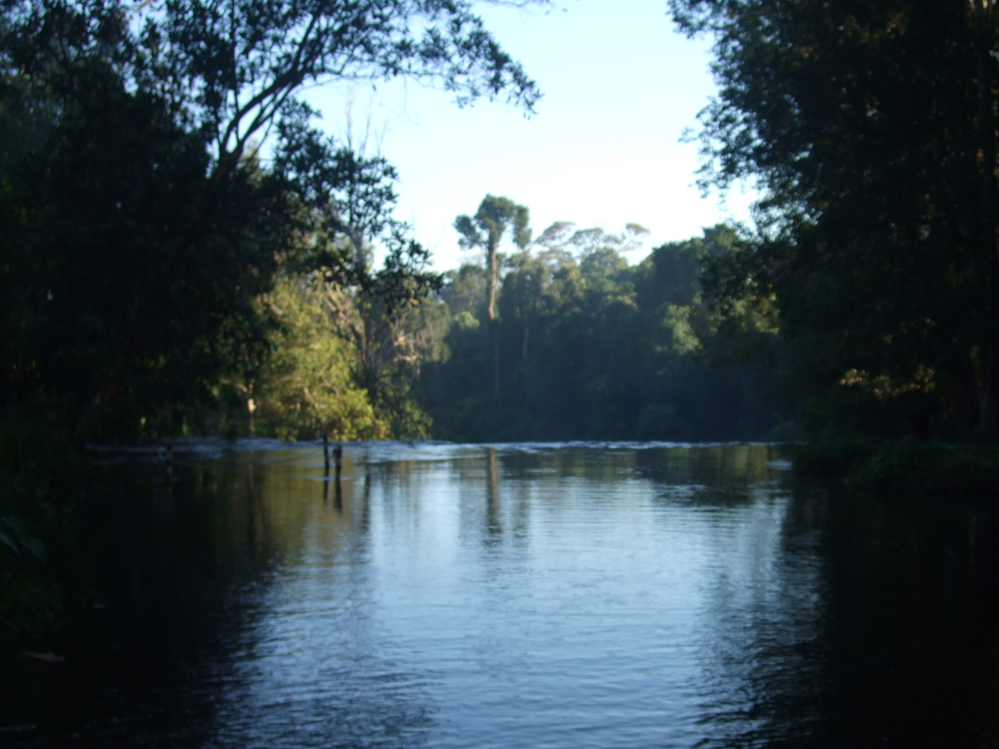
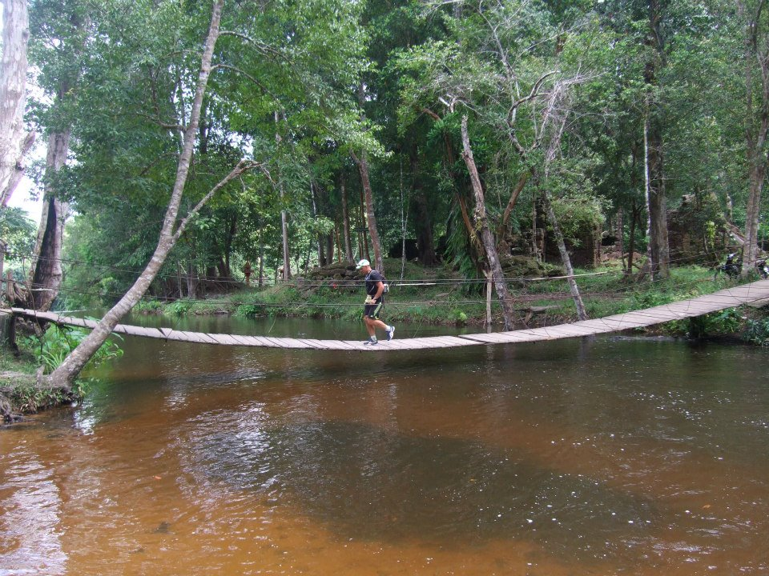

::: {.eyebrow}
Therapie
:::

Twee methoden: **MBMR** (deze pagina) en de bredere
[(Her-)Synchroniserende Therapie Methode (STM)](stm.qmd), waarin MBMR de
lichamelijke ruggengraat vormt.

{.therapy-hero fig-alt=""}

## Wat is MBMR

Specifiek model bilaterale bewegingstherapie bij traumatische herinneringen met
centraal mechanisme van het alterneren van bewustzijnstoestanden in de
verschillende modaliteiten; 1. Tijd ('heden' , 'verleden', 'toekomst' ) en
2. Object van aandacht ('interne stimulus',  'externe stimulus', 'stimulus vrij').

## De twee modaliteiten

Het alterneren gebeurt langs twee assen. Elke sessie beweegt de aandacht van de
cliënt door de negen combinaties die deze assen samen opspannen.

::: {layout-ncol=2}
::: {.card .p-4}
#### 1 · Tijd

- heden
- verleden
- toekomst
:::

::: {.card .p-4}
#### 2 · Object van aandacht

- interne stimulus
- externe stimulus
- stimulus vrij
:::
:::

## Voor wie

De methode wordt ingezet bij:

- Trauma / PTSS
- Angst en paniek
- Burn-out en overspanning
- Depressieve klachten
- Rouw en verlies
- Chronische stress
- Lichamelijke spanningsklachten
- Persóónlijke ontwikkeling (geen klacht)

## Praktisch

Intake 60 minuten, waarbij psychodiagnostisch onderzoek wordt gedaan om de
'avidya' en 'dukkha' waardes te bepalen middels de door mij ontwikkelde
psychodiagnostisch onderzoek. Vervolgens volgt een Bewegingstherapie programma,
bijvoorbeeld Mindful Hardloop Therapy (MHT) van 8 weken lang, 2 keer per week
waarbij de sessies van 1,5 uur per keer een vaste format hebben die ik
ontwikkeld heb.

| | |
|---|---|
| Intake | 60 minuten, met psychodiagnostisch onderzoek |
| Programma | 8 weken, 2 sessies per week |
| Sessieduur | 1,5 uur, vast format |
| Voorbeeld | Mindful Hardloop Therapy (MHT) |

::: {layout-ncol=2}
{fig-alt=""}

{fig-alt=""}
:::

## In voorbereiding

Drie onderdelen van deze pagina volgen zodra de bijbehorende tekst klaar is.

**Fasen van een sessie** — het vaste format van de sessie van 1,5 uur, fase voor fase.

**Onderbouwing en EMDR** — waar MBMR uit voortkomt, en waarin de methode van EMDR verschilt.

**Relatie met RTC** — hoe de methode aansluit bij de ontologie van de Resonating
Self uit het proefschrift. Zie voorlopig [de theoriepagina](theory.qmd).

## Aanmelden voor een intake

Een traject begint met een intake van 60 minuten. Neem contact op om die te plannen.

[Naar het contactformulier](contact.qmd){.btn .btn-primary}
